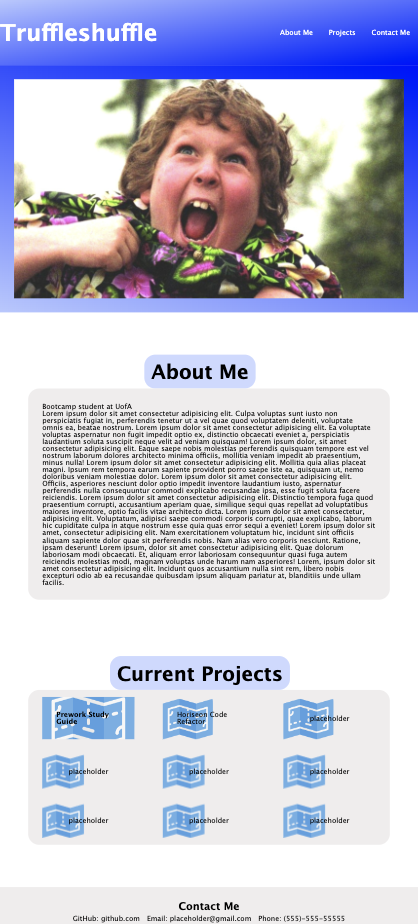

# My Developer Portfolio

## Description

This application was our second challenge in the coding bootcamp. It was the first time we had to set up a HTML file, a 
CSS file, and import our own images. This challnege was designed to get us familiar with applying semantic HTML elements and
properely displaying links and images. The second part of the challenge was to apply all of the different CSS rules we had learned
in class. This was the first time I used the display flex property and media queries to tell the content on the page how to shrink
and grow as the browser expanded and retracted.

## Installation

N/A

## Usage

All the links in the nav bar placed in the header will direct you to their corresponding main section. The about me section
gives a little bit of information about me as a professional developer. The projects section has links that will send you
to my completed project. As I am first deploying this application most of the information is just placeholder information. As I continue
to learn and grow as a developer I will add links and inforamtion as to what skills I have picked up. You can follow this link
to the deployed application in GitHub pages: https://trufl.github.io/Dev-Portfolio/

The following shows how the application should look at a width of 768 pixels:

    ```md
    
    ```

## Credits

N/A

## License

N/A